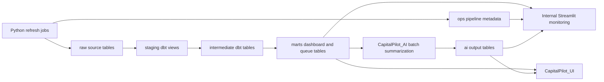

# CapitalPilot_DataPipeline

CapitalPilot_DataPipeline is the ingestion, transformation, scheduling, and
observability repo for CapitalPilot research data.

It is for personal research only. It is not financial advice, does not automate
trading, does not connect to brokerage APIs, and does not produce deterministic
buy/sell recommendations.

## Three-Repo Boundary

CapitalPilot is split into three repos:

- `CapitalPilot_DataPipeline`: source ingestion, raw/staging/intermediate/mart
  schemas, dbt transformations, scheduled refresh jobs, AI queue contracts, AI
  output table schemas, and internal Streamlit observability.
- `CapitalPilot_AI`: LLM orchestration, summarization, prompt versions,
  AI-as-tool refresh logic, and any future MCP/tool-calling implementation.
- `CapitalPilot_UI`: final user-facing frontend that reads marts and AI summary
  tables.

This repo does not host an interactive MCP research agent or end-user AI chat.
`CapitalPilot_AI` reads queue marts from this repo, writes structured summaries
to `ai.*` tables, and `CapitalPilot_UI` displays those outputs.

## Phase 2 Capabilities

- FRED macro ingestion and yfinance price ingestion from Phase 1.
- SEC `10-K`, `10-Q`, and `8-K` metadata ingestion from EDGAR, plus optional
  filing document download.
- Configurable daily news metadata ingestion with manual CSV and optional Alpha
  Vantage provider support.
- Public political/high-official disclosure schema with manual CSV ingestion and
  documented Senate, House, and OGE source scaffolds.
- Long-term accumulation research indicators.
- Options math and optional option-chain schema/provider.
- Daily technical indicators and market summary marts.
- Ops metadata tables for runs, tasks, errors, and freshness checks.
- Internal Streamlit pipeline dashboard.

## AI Contracts

Queue marts produced by dbt:

- `marts.mart_sec_ai_summary_queue`
- `marts.mart_news_ai_summary_queue`

AI output tables created by DataPipeline and written by `CapitalPilot_AI`:

- `ai.sec_filing_summaries`
- `ai.news_summaries`

Summary labels should stay research-oriented, such as `bullish`, `bearish`,
`mixed`, `neutral`, and `unknown`. They must not become deterministic trading
instructions.

## Database Schema and Relationship Visualizations

CapitalPilot_DataPipeline uses DuckDB locally and MotherDuck in production with
the same schema layout. Python jobs write raw and ops tables; dbt builds
staging, intermediate, and mart models; `CapitalPilot_AI` writes structured AI
summary outputs back into the `ai` schema.



Core schemas:

- `raw`: source-aligned ingestion tables with raw payloads, source URLs, and
  `updated_at` audit timestamps.
- `staging`: normalized dbt views with type cleanup and light filtering.
- `intermediate`: reusable transformation tables for calculations and joins.
- `marts`: dashboard-ready tables and AI queue contracts.
- `ai`: structured AI summary destination tables written by `CapitalPilot_AI`.
- `ops`: run/task/error/freshness metadata for pipeline monitoring.

Raw source tables:

| Raw table | Written by | Purpose | Downstream dependencies |
| --- | --- | --- | --- |
| `raw.raw_macro_observations` | `jobs/refresh_macro.py` | FRED macro observations | `stg_macro_observations` -> `int_macro_calculations` -> `mart_macro_dashboard`; also informs `int_accumulation_signals` |
| `raw.raw_prices` | `jobs/refresh_prices.py` | Daily OHLCV and market-cap rows | `stg_prices` -> valuation, technical, accumulation, and political watchlist-overlap models |
| `raw.raw_sec_company_tickers` | `jobs/refresh_sec_filings.py` | SEC ticker-to-CIK reference | Used by ingestion for CIK lookup; retained for audit/reference |
| `raw.raw_sec_filings` | `jobs/refresh_sec_filings.py` | SEC `10-K`, `10-Q`, `8-K` filing metadata | `stg_sec_filings` -> SEC dashboards, 8-K alerts, and SEC AI queue |
| `raw.raw_sec_filing_documents` | `jobs/refresh_sec_filings.py --download-documents` | Downloaded SEC primary document text/status | `stg_sec_filing_documents` -> `mart_sec_ai_summary_queue` |
| `raw.raw_sec_companyfacts` | Optional future SEC job | SEC companyfacts JSON payloads | Reserved for future fundamentals/valuation models |
| `raw.raw_news_articles` | `jobs/refresh_news.py` | News article metadata from manual/Alpha Vantage providers | `stg_news_articles` -> news dashboard and news AI queue |
| `raw.raw_political_disclosure_reports` | `jobs/refresh_political_trades.py` | Official disclosure report metadata and source URLs | Raw/source preview and report audit trail |
| `raw.raw_political_transactions` | `jobs/refresh_political_trades.py` | Parsed manual or House PTR transaction rows | `stg_political_transactions` -> political trading mart |
| `raw.raw_options_chain` | `jobs/refresh_options.py` | Optional option-chain rows | `stg_options_chain` -> options feature and dashboard marts |

Domain dependency map:

```mermaid
flowchart TB
    raw_macro["raw.raw_macro_observations"] --> stg_macro["stg_macro_observations"]
    stg_macro --> int_macro["int_macro_calculations"]
    int_macro --> mart_macro["mart_macro_dashboard"]
    int_macro --> int_accum["int_accumulation_signals"]

    raw_prices["raw.raw_prices"] --> stg_prices["stg_prices"]
    stg_prices --> int_val["int_valuation_inputs"]
    int_val --> mart_val["mart_valuation_dashboard"]
    stg_prices --> int_price_features["int_price_technical_features"]
    int_price_features --> int_tech["int_technical_indicators"]
    int_tech --> mart_tech["mart_technical_dashboard"]
    mart_tech --> mart_market["mart_daily_market_summary"]
    int_price_features --> int_accum
    int_accum --> mart_accum["mart_accumulation_dashboard"]

    raw_sec["raw.raw_sec_filings"] --> stg_sec["stg_sec_filings"]
    raw_sec_docs["raw.raw_sec_filing_documents"] --> stg_sec_docs["stg_sec_filing_documents"]
    stg_sec --> int_recent_sec["int_recent_sec_filings"]
    int_recent_sec --> int_8k["int_watchlist_recent_8k"]
    int_8k --> mart_8k["mart_watchlist_8k_alerts"]
    stg_sec --> int_10k["int_sec_10k_history"]
    stg_sec --> mart_sec_dash["mart_sec_filings_dashboard"]
    int_recent_sec --> mart_sec_queue["mart_sec_ai_summary_queue"]
    stg_sec_docs --> mart_sec_queue
    ai_sec["ai.sec_filing_summaries"] --> mart_sec_queue

    raw_news["raw.raw_news_articles"] --> stg_news["stg_news_articles"]
    stg_news --> int_news["int_news_deduped"]
    int_news --> int_news_daily["int_daily_news_by_category"]
    int_news_daily --> mart_news_dash["mart_daily_news_dashboard"]
    int_news --> mart_news_queue["mart_news_ai_summary_queue"]
    ai_news["ai.news_summaries"] --> mart_news_queue

    raw_pol_tx["raw.raw_political_transactions"] --> stg_pol["stg_political_transactions"]
    stg_pol --> int_pol_norm["int_political_trades_normalized"]
    stg_prices --> int_pol_norm
    int_pol_norm --> int_pol_owner["int_political_ticker_ownership"]
    int_pol_norm --> mart_pol["mart_political_trading_dashboard"]
    int_pol_owner --> mart_pol

    raw_options["raw.raw_options_chain"] --> stg_options["stg_options_chain"]
    stg_options --> int_options["int_options_features"]
    int_options --> mart_options["mart_options_dashboard"]
```



Ops and AI contract tables:

| Table | Writer | Reader | Notes |
| --- | --- | --- | --- |
| `ops.pipeline_runs` | All refresh jobs/orchestrator | Streamlit internal dashboard | One row per pipeline/job run |
| `ops.pipeline_task_runs` | All refresh jobs/orchestrator | Streamlit internal dashboard | Task-level success, failure, skipped state, row counts |
| `ops.pipeline_errors` | All refresh jobs/orchestrator | Streamlit internal dashboard | Error type, message, and JSON context |
| `ops.data_freshness_checks` | `jobs/run_pipeline.py` | Streamlit internal dashboard | Latest row count and max timestamp by domain/table |
| `ai.sec_filing_summaries` | `CapitalPilot_AI` | dbt queue mart, Streamlit, UI | Structured filing summary output |
| `ai.news_summaries` | `CapitalPilot_AI` | dbt queue mart, Streamlit, UI | Structured news summary/sentiment output |

## Data Sources and Limits

- SEC: free EDGAR endpoints using `SEC_USER_AGENT`; fair-access retry, timeout,
  and rate limiting are enforced in `src/sec_client.py`.
- Macro: FRED API through `FRED_API_KEY`.
- Prices: yfinance daily history.
- News: manual CSV works offline; Alpha Vantage `NEWS_SENTIMENT` is optional.
  Future documented options include Finnhub, Benzinga, GDELT, and permitted RSS.
- Political disclosures: manual CSV ingestion works now. Senate, House, and OGE
  sources often involve PDFs, search forms, and delayed range disclosures, so
  exact holdings must not be inferred. House Periodic Transaction Reports can be
  ingested automatically from the official House Clerk yearly XML index and PTR
  PDFs.
- Options: Black-Scholes, Greeks, payoff, and vertical-spread calculators are
  deterministic. yfinance option-chain ingestion is optional and disabled by
  default.

## Local Setup

Python 3.11 is recommended and declared in `runtime.txt`.

```bash
pip install -r requirements.txt
cp dbt/profiles.yml.example dbt/profiles.yml
python jobs/run_pipeline.py --target local --run-dbt
streamlit run app.py
```

Individual jobs:

```bash
python jobs/refresh_macro.py --target local
python jobs/refresh_prices.py --target local
python jobs/refresh_sec_filings.py --target local --forms 10-K,10-Q,8-K
python jobs/refresh_news.py --target local --provider manual
python jobs/refresh_political_trades.py --target local --source manual --manual-file tests/fixtures/political_transactions_sample.csv
python jobs/refresh_political_trades.py --target local --source house --days-back 120 --max-reports 5
python jobs/refresh_options.py --target local --force
```

Optional jobs skip gracefully in `jobs/run_pipeline.py` when source secrets or
providers are unavailable. Direct SEC refresh requires a valid `SEC_USER_AGENT`.
The House official-trades source downloads public PTR PDFs, so start with a
small `--max-reports` value before widening the date range.

## MotherDuck

```bash
export CAPITALPILOT_DB_TARGET=motherduck
export MOTHERDUCK_TOKEN=your_token
export FRED_API_KEY=your_fred_key
export SEC_USER_AGENT="CapitalPilot contact@yourdomain.com"

python jobs/run_pipeline.py --target motherduck --run-dbt
```

## Secrets

Required for production MotherDuck:

- `MOTHERDUCK_TOKEN`

Required for specific source jobs:

- `FRED_API_KEY` for macro refresh.
- `SEC_USER_AGENT` for SEC refresh.

Optional:

- `ALPHA_VANTAGE_API_KEY` for Alpha Vantage news.
- Other future news provider keys.

LLM keys belong in `CapitalPilot_AI`, not this repo.

## GitHub Actions

`.github/workflows/refresh_capitalpilot.yml` runs Python 3.11, installs
dependencies, validates dbt, runs:

```bash
python jobs/run_pipeline.py --target motherduck --run-dbt
```

Then it generates dbt docs and uploads dbt artifacts. Configure these GitHub
secrets as applicable:

- `MOTHERDUCK_TOKEN`
- `FRED_API_KEY`
- `SEC_USER_AGENT`
- `ALPHA_VANTAGE_API_KEY`

## Streamlit Internal Testing and Monitoring Dashboard

`streamlit run app.py` opens an internal DataPipeline observability console. It
is for local testing, source validation, dbt/model sanity checks, and production
pipeline monitoring. It is not the final user-facing frontend, not an AI chat
surface, and not a trading dashboard.

The Streamlit pages read from DuckDB/MotherDuck tables only. They do not perform
source ingestion, call LLMs, execute trades, or write AI summaries.

| Page | File | Internal monitoring function |
| --- | --- | --- |
| DataPipeline command center | `app.py` | Shows database target/connection, latest pipeline run status, task runs, freshness checks, row counts across raw/mart/AI tables, AI summary queue counts, recent errors, and quick record previews by domain. |
| Macro Monitor | `pages/1_📊_Macro_Monitor.py` | Tests and visualizes `marts.mart_macro_dashboard`; confirms macro rows, regime labels, rates, inflation, labor, dollar, and volatility calculations are populated. |
| SEC Filing Pipeline | `pages/2_📄_SEC_Filing_Agent.py` | Monitors SEC ingestion output, recent filing dashboard rows, recent 8-K alerts, and `marts.mart_sec_ai_summary_queue` status. It does not run interactive SEC AI chat. |
| Valuation Engine | `pages/3_💰_Valuation_Engine.py` | Validates Phase 1 price/market-cap valuation marts and price history availability while fundamentals remain future SEC companyfacts work. |
| official_trade | `pages/4_official_trade.py` | Monitors public official disclosure ingestion, raw report/transaction row counts, latest filings, top disclosed tickers, branch summaries, filterable transaction rows, source freshness, task runs, parser errors, and raw table previews. |

Recommended local monitoring flow:

```bash
python jobs/run_pipeline.py --target local --run-dbt
streamlit run app.py
```

For automated House official-trade testing:

```bash
python jobs/run_pipeline.py --target local --run-dbt --political-source house --political-max-reports 5
streamlit run app.py
```

Stop Streamlit before local DuckDB write-heavy refreshes if Windows reports that
`data/capitalpilot.duckdb` is locked by another Python process.

## dbt

Local:

```bash
cd dbt
dbt build --profiles-dir . --target dev
```

Production:

```bash
cd dbt
dbt build --profiles-dir . --target prod
```

Schemas:

- `raw`
- `staging`
- `intermediate`
- `marts`
- `ai`
- `ops`

## Tests

```bash
pytest
```

Tests use fixtures and mocks; they do not require live external API calls.

## Disclaimers

CapitalPilot is personal research software only. It is not investment advice.
It does not automate trading, execute orders, connect to brokerage accounts, or
produce deterministic buy/sell recommendations. Political disclosures may be
delayed, incomplete, and range-based. News sentiment and AI summaries are model
interpretations and may be wrong.
